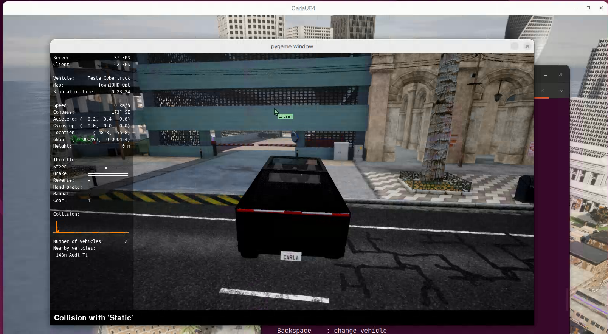

[](https://classroom.github.com/a/peCxHnxY)
# EE267_LAB0: Access CARLA

This repository collects the helper scripts I used while working through EE267 Lab 0. For the complete assignment statement and grading rubric please refer to the official Google Doc shared by the teaching team.

---

## 0. Start the CARLA server and client environment
Local machine snapshot:
- Ubuntu 22.04
- NVIDIA RTX 4070 (8 GB VRAM)

### 0.1 Run the CARLA 0.9.15 server (Docker)
```bash
docker pull carlasim/carla:0.9.15
# Forward the default RPC/streaming ports (2000-2002)
docker run --gpus all --rm \
  -p 2000-2002:2000-2002 \
  -e DISPLAY=$DISPLAY \
  -v /tmp/.X11-unix:/tmp/.X11-unix \
  carlasim/carla:0.9.15
```
If you installed the native package you can alternatively run `<CARLA_ROOT>/CarlaUE4.sh -quality-level=Epic`.

### 0.2 Prepare the Python client
```bash
conda create -n carla python=3.10 -y
conda activate carla
pip install -r requirements.txt
# or: pip install carla==0.9.15` when using the prebuilt wheel
```

---

## 1. Manual control sanity check
```bash
python3 manual_control.py --host 127.0.0.1 --port 2000
```
Control the ego vehicle with the keyboard/gamepad as described in the CARLA quickstart.



---

## 2. `carla_api.py` – traffic manager playground
Script: `carla_api.py`

### 2.1 Usage
```bash
python3 carla_api.py \
  --host 127.0.0.1 --port 2000 \
  --traffic-manager-port 8000 \
  --map Town03 \
  --sync --fixed-delta 0.05 \
  --vehicles 60 --duration 120 \
  --spectator-follow
```
Important flags:
- `--routes`: define TM paths using the tutorial syntax `spawn_idx:wp_idx,...`. Two Town03 congestion routes are provided as defaults.
- `--ignore-lights`, `--no-lane-change`, `--speed-offset`: expose the Traffic Manager knobs highlighted in the official guide.
- `--draw-spawn-points`: overlay spawn indices in the world for quick debugging.

### 2.2 Notes from the official tutorial
- The script can run in synchronous mode, pairing world ticks and TM steps for repeatable experiments.
- Vehicles following the custom paths are spawned first; the remainder fill random spawn points until the requested fleet size is reached.
- When `--spectator-follow` is set the spectator hovers behind the first routed actor, matching the camera setup used in the documentation.

### 2.3 FAQ
- **What is the default probability of running a red light?** Unless `ignore_lights_percentage` is invoked the probability stays at 0%. Passing `--ignore-lights 0,50` reproduces the tutorial scenario where some NPCs ignore lights.
- **Why enable synchronous mode?** `traffic_manager.set_synchronous_mode(True)` keeps simulation and TM in lockstep, which makes dense-traffic reproductions and data capture deterministic.

---

## 3. `bbox.py` – project 3D bounding boxes to the camera plane
Script: `bbox.py`

### 3.1 Dependencies
- Requires `numpy`; the script exits with a clear hint when the module is missing.
- Uses the Traffic Manager to keep spawned NPCs moving around the hero vehicle.

### 3.2 Example run
```bash
python3 bbox.py \
  --host 127.0.0.1 --port 2000 \
  --traffic-manager-port 8000 \
  --map Town03 --sync --frames 20 \
  --save-images --save-json \
  --output output/bbox
```
Outputs:
- RGB frames when `--save-images` is set (`output/bbox/000123.png`, ...).
- A COCO-like JSON file (`output/bbox/bounding_boxes.json`) containing the frame number, timestamp, and `[x_min, y_min, x_max, y_max]` for each visible vehicle.

### 3.3 Implementation highlights
- Builds the intrinsic matrix with the tutorial formula `f = width / (2 * tan(fov/2))`.
- Converts UE4 coordinates to a conventional camera space `(x, y, z) -> (y, -z, x)` before projecting all eight vertices of each bounding box.
- Rejects actors that are behind the camera, outside the image plane, or farther than the configured threshold.

### 3.4 FAQ
- **How can I export PASCAL VOC annotations?** Plug the recorded `frame_boxes` into `pascal_voc_writer.Writer` as shown in the tutorial; the script keeps the loop structure ready for that extension.
- **Why does the JSON store `x_min`, `y_min`, `x_max`, `y_max`?** That layout matches the instructions for both VOC and COCO conversions in the CARLA guide.
- **How do I correlate with instance IDs?** Combine the RGB frame with the instance segmentation output (R channel = semantic ID, G/B = instance ID) to recover the exact object labels.

---

## 4. `instance_segmentation.py` – fixed-view collection of instance IDs
Script: `instance_segmentation.py`

### 4.1 Example run
```bash
python3 instance_segmentation.py \
  --host 127.0.0.1 --port 2000 \
  --map Town03 --sync \
  --frames 10 --vehicles 80 --radius 90 \
  --output output/instance
```
Pipeline:
1. Moves the spectator and segmentation camera to the reference pose from the tutorial (adjust with `--camera-location` / `--camera-rotation`).
2. Spawns vehicles within the configured radius so that each instance ID corresponds to a visible actor.
3. Captures N frames from `sensor.camera.instance_segmentation` and writes `instance_*.png` files to the output directory.

### 4.2 Key details
- The R channel stores the semantic label; the G and B channels encode the unique instance ID exactly as described in the documentation.
- Synchronous mode keeps the queue consumption deterministic. Without `--sync` the script still waits for new ticks so that frames are not dropped.
- Vehicle spawning follows the 80 m filter from the tutorial and can be tightened or relaxed via `--radius` and `--vehicles`.

### 4.3 FAQ
- **How do I map IDs to human readable names?** Use the CARLA label maps (e.g. `label_names.json`) to decode the semantic ID from the R channel, then group pixels with identical (G,B) pairs for per-instance masks.
- **Why use a `queue.Queue` for the sensor?** The tutorial recommends pushing frames into a queue so the main loop can synchronise `world.tick()` with `sensor.listen(...)`, preventing race conditions.

---

## 5. References
- [Traffic Manager tutorial](https://carla.readthedocs.io/en/docs-preview/tuto_G_traffic_manager/)
- [Bounding boxes tutorial](https://carla.readthedocs.io/en/latest/tuto_G_bounding_boxes/)
- [Instance segmentation sensor tutorial](https://carla.readthedocs.io/en/latest/tuto_G_instance_segmentation_sensor/)

Reading through these pages provides the background for every design choice in the helper scripts above and suggests many follow-up experiments (custom TM routes, exporting datasets, decoding instance masks, and so on).
