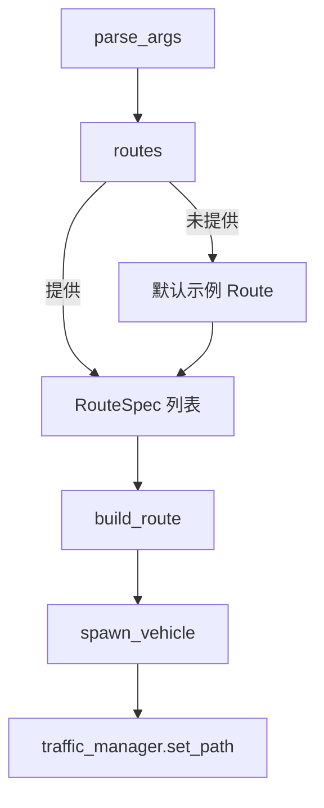

# `carla_api.py` 中的 Route 机制说明

## 1. Route 的定义与作用
- 脚本通过 CARLA Traffic Manager (TM) 创建可复现的交通流，`route` 用来为特定车辆指定一条固定行驶路径。
- Route 的本质是 TM 需要跟随的一系列地图坐标 (`carla.Location`)，配合车辆的起始 `Transform`，可以重现特定的拥堵或行为场景。
- 若未显式提供 route，脚本会使用内置的两条示例路径，确保至少有若干车辆遵循固定线路。

## 2. Route 如何被选择
- 命令行参数 `--routes` 接收若干字符串，格式为 `"<spawn_index>:idx0,idx1,..."`。每一条字符串描述一辆需要遵循固定路线的车辆。
- 如果用户没有传入 `--routes`，脚本默认回退到两个硬编码的 route (`32:129,28,124,33,97,119,58,154,147` 与 `149:21,76,38,34,90,3`)。
- 这些索引都是针对当前地图全部 spawn point（出生点）列表的下标，因此在不同地图上需要自行确认索引合法性。

## 3. RouteSpec 与 `parse_route_spec`
- `RouteSpec` 数据类将一条 route 拆分为：
  - `spawn_index`: 车辆生成点在 `spawn_points` 列表中的下标。
  - `waypoint_indices`: 车辆行驶过程中需要依次经过的 spawn point 下标。
- `parse_route_spec` 会：
  1. 基于冒号分割出出生点与路径点部分；
  2. 将逗号分隔的路径索引转换为整数列表；
  3. 进行必要的格式校验，保证至少有一个 waypoint。
- 解析成功后，得到的 `RouteSpec` 会在后续用于构造真正的 CARLA 路径数据。

## 4. `build_route` 函数的职责
- 输入：`RouteSpec` 与完整的 `spawn_points` 序列。
- 主要步骤：
  1. 检查 `spawn_index` 是否越界，得到车辆初始的 `carla.Transform`；
  2. 遍历 `waypoint_indices`，逐个验证合法性，并提取对应 spawn point 的 `location`；
  3. 返回 `(route_spawn, waypoint_locations)`，分别用于生成车辆和给 TM 设置路径。
- 该函数保证所有索引都合法，避免向 TM 提交错误路径。

## 5. Route 在主流程中的执行位置
1. `main` 中加载地图、获取全部 spawn point 后，首先确定最终路线列表：优先使用 `--routes`，否则使用示例数据。
2. 对每条 route：
   - 调用 `build_route` 构建车辆起点 (`spawn_transform`) 与路径点列表 (`waypoint_locations`)；
   - 随机选择车辆蓝图并生成车辆，首条路线的车辆会被标记为 `hero` 以方便观测；
   - 为车辆应用 TM 的个性化设定（车距、限速、变道策略等）；
   - 使用 `traffic_manager.set_path(spawned, waypoint_locations)` 将路线提交给 TM，TM 会驱动该车辆逐点行驶。
3. 等全部 route 车辆生成后，再补充随机交通流，避免 route 车辆因 spawn 点冲突而生成失败。

## 6. Route 底层实现细节
- `traffic_manager.set_path` 接收的 `waypoint_locations` 是一组 `carla.Location`。TM 会在内部将其转换为 CARLA 的导航路网（Waypoints），并安排车辆依序通过这些目标点。
- 路径在 TM 内部以循环方式处理：到达最后一个地点后，车辆会继续沿道路网络前进或进入默认行为，具体取决于 TM 当前的配置。
- `spawn_points` 来源于 `world.get_map().get_spawn_points()`，由地图预定义。使用索引的方式确保 route 对应地图版本保持可复现性。

## 7. 函数之间的调用关系（Route 相关）

- `parse_args`：读取 `--routes` 参数，生成 `RouteSpec` 列表。
- `build_route`：将下标映射为真实的起点与路径点。
- `spawn_vehicle`：创建并注册车辆，交由 TM 控制。
- `traffic_manager.set_path`：让 TM 驱动车辆按照给定路线运行。

## 8. 运行流程摘要
1. 初始化客户端、世界与 TM，获取地图 spawn points。
2. 根据参数或示例，构建所有 route 的起点与路径。
3. 对每条 route 生成车辆、配置属性，并调用 TM 设置路径。
4. 补充随机车辆，形成背景交通。
5. 在同步或异步循环中运行到设定时间，结束时销毁车辆。

这一套设计使得开发者可以快速在 CARLA 内复现确定性的交通场景，同时保留随机交通以模拟更真实的路况。
